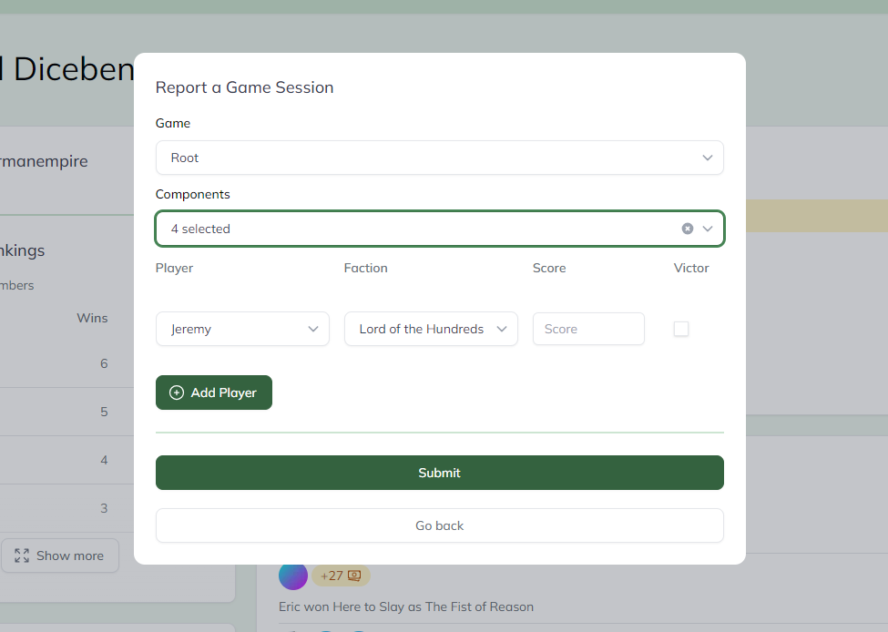
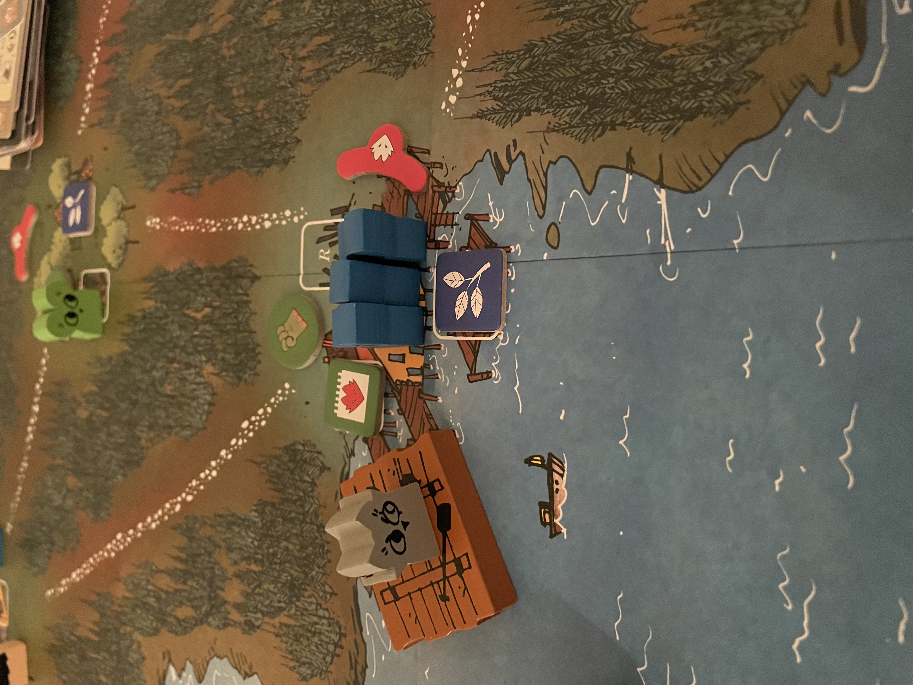

As an avid board gamer and data geek, visualizations within games showing your performance have always been interesting to me. It could be a breakdown of how many shots you've taken with each gun in Ghost Recon Wildlands or how many times you've cut people off in Curve Fever -- either way I loved digging into the details. That's why I built Dicebender, a game tracking app for your gaming groups. Built for small groups, conventions, and game shops.

### How it levels up your gaming group
No more baseless claims of who's the best -- now you'll know. With Dicebender, you can track every game your group plays. This includes what faction each player played, their score, and more! This gives you access to all sorts of fun stats like your win frequency with certain 7 Wonders factions, or even how well you perform on different maps in Root!

### Its foundations
Dicebender's first commit was on June 22nd, 2023. 46 days later and development is flying along! It runs using Next.js, a cutting-edge Node.js framework that utilizes React. I originally started building Dicebender in Symfony (under a different name: Victor). However, upon working with Next.js, I quickly fell in love with the streamlined JavaScript framework and started over in Next.js.

